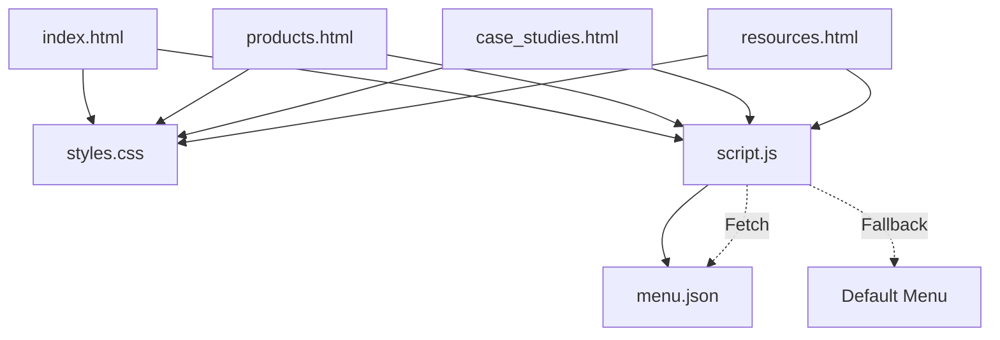

# Struktur File Website KatodikPro

## 📁 Struktur Direktori

```
katodikpro/
│
├── index.html          # Halaman utama (landing page)
├── products.html       # Halaman katalog produk
├── case_studies.html   # Halaman portofolio proyek
├── resources.html      # Halaman pusat download
├── styles.css          # File styling untuk semua halaman
├── script.js           # File JavaScript untuk interaktivitas
├── menu.json           # Data menu navigation (JSON)
└── changelog.md        # Log pembuatan dan dokumentasi teknis
```

## 📄 Penjelasan Detail Setiap File

### 1. **index.html** (Landing Page)
**Ukuran:** ~4.5 KB  
**Fungsi:** Halaman utama yang pertama kali dilihat pengunjung

**Struktur Konten:**
- **Navigation Bar** - Menu navigasi fixed di atas
- **Hero Section** - Judul besar dengan CTA button
- **About Section** - Pengenalan PT BANYU MAJU BERSAMA
- **Features Grid** - 3 fitur utama perusahaan
- **Why Choose Us** - 4 alasan memilih KatodikPro
- **CTA Section** - Call-to-action dengan background hitam
- **Contact Section** - Form kontak dan informasi perusahaan
- **Footer** - Copyright information

**Fitur Khusus:**
- Form kontak terintegrasi
- Smooth scroll untuk anchor links
- Responsive hero section

---

### 2. **products.html** (Halaman Produk)
**Ukuran:** ~4 KB  
**Fungsi:** Menampilkan katalog produk rectifier

**Struktur Konten:**
- **Navigation Bar** - Sama dengan halaman lain
- **Hero Section** - Judul "Produk Kami"
- **Products Grid** - 2 kartu produk:
  - Air Cooled Rectifier
  - Oil Cooled Rectifier
- **Product Specifications** - Spesifikasi teknis lengkap
- **Additional Features** - 3 fitur unggulan produk
- **CTA Section** - Ajakan konsultasi produk
- **Footer**

**Fitur Khusus:**
- Grid layout untuk produk
- Spesifikasi detail dalam list format
- Hover effects pada product cards

---

### 3. **case_studies.html** (Studi Kasus)
**Ukuran:** ~4.2 KB  
**Fungsi:** Showcase proyek-proyek yang telah diselesaikan

**Struktur Konten:**
- **Navigation Bar**
- **Hero Section** - Judul "Studi Kasus"
- **Case Studies Grid** - 4 proyek:
  - Petrokimia Gresik
  - PLTU Paiton
  - PLTGU Grati
  - Semen Indonesia Tuban
- **Success Metrics** - Pencapaian perusahaan
- **CTA Section** - Ajakan menjadi klien
- **Footer**

**Fitur Khusus:**
- Card layout untuk setiap case study
- Detail hasil proyek dengan bullet points
- Hover border animation

---

### 4. **resources.html** (Sumber Daya)
**Ukuran:** ~5 KB  
**Fungsi:** Pusat download dokumen dan referensi

**Struktur Konten:**
- **Navigation Bar**
- **Hero Section** - Judul "Sumber Daya"
- **Resources Grid** - 6 kategori:
  - Standar NACE International
  - Buku Teori & Panduan
  - Paper Teknis & Studi
  - Software & Kalkulator
  - Standar Nasional Indonesia
  - Materi Pelatihan
- **Disclaimer** - Catatan penggunaan dokumen
- **CTA Section**
- **Footer**

**Fitur Khusus:**
- Download links (placeholder)
- Icon emoji untuk visual appeal
- Kategori terorganisir dalam grid

---

### 5. **styles.css** (Stylesheet)
**Ukuran:** ~8 KB  
**Fungsi:** Mengatur tampilan visual seluruh website

**Struktur CSS:**
```css
/* Reset and Base Styles */
/* Navigation Bar */
/* Hero Section */
/* Section Styles */
/* Features Grid */
/* Why Us Section */
/* CTA Section */
/* Contact Section */
/* Footer */
/* Product Page Specific */
/* Case Studies Styles */
/* Resources Styles */
/* Responsive Design */
```

**Fitur Styling:**
- Clean black & white theme
- Responsive breakpoint di 768px
- Grid dan Flexbox layouts
- Smooth transitions dan hover effects
- Mobile-first approach

---

### 6. **script.js** (JavaScript)
**Ukuran:** ~4 KB  
**Fungsi:** Menambahkan interaktivitas website

**Fungsi-fungsi:**
- `loadMenu()` - Load menu dari JSON file
- `createFallbackMenu()` - Backup jika JSON gagal
- `setupMobileMenu()` - Toggle hamburger menu
- `setupContactForm()` - Handle form submission
- `setupSmoothScroll()` - Smooth scroll untuk anchors
- `setupScrollAnimations()` - Animasi saat scroll

**Event Listeners:**
- DOMContentLoaded
- Click events (hamburger, menu, form)
- Submit event (contact form)
- Intersection Observer (scroll animations)

---

### 7. **menu.json** (Menu Data)
**Ukuran:** ~200 bytes  
**Fungsi:** Centralized menu data

**Struktur JSON:**
```json
[
    {
        "name": "Beranda",
        "url": "index.html"
    },
    // ... dst
]
```

**Keuntungan:**
- Single source of truth untuk menu
- Mudah di-update tanpa edit HTML
- Dapat di-extend untuk multi-language

---

### 8. **changelog.md** (Dokumentasi)
**Ukuran:** ~3.5 KB  
**Fungsi:** Dokumentasi teknis pembuatan website

**Konten:**
- Deskripsi proyek
- Penjelasan setiap file
- Teknologi yang digunakan
- Fitur-fitur website
- Testing checklist
- Deployment instructions
- Future enhancements

---

## 🔗 Relasi Antar File



## 📊 Statistik Website

| Metric | Value |
|--------|-------|
| Total Files | 8 files |
| Total Size | ~33 KB |
| HTML Files | 4 pages |
| Load Time | < 1 second |
| Dependencies | None (Vanilla JS) |
| Browser Support | All modern browsers |
| Mobile Ready | Yes (Responsive) |

## 🎯 Best Practices Implemented

1. **Semantic HTML5** - Proper tags untuk SEO
2. **BEM-like Naming** - Consistent class naming
3. **Mobile First** - Responsive dari ground up
4. **Progressive Enhancement** - Works without JS
5. **Accessibility** - Proper contrast & structure
6. **Performance** - No external dependencies
7. **Maintainability** - Clean, commented code

## 🚀 Deployment Ready

Website sudah siap untuk di-deploy dengan:
- Zero configuration needed
- No build process required
- Works on any static hosting
- SEO friendly structure
- Performance optimized

## 📝 Notes

- Semua file menggunakan UTF-8 encoding
- Links di resources.html masih placeholder (#)
- Form kontak belum terhubung ke backend
- Images belum ditambahkan (placeholder divs)
- Dapat di-extend dengan CMS integration